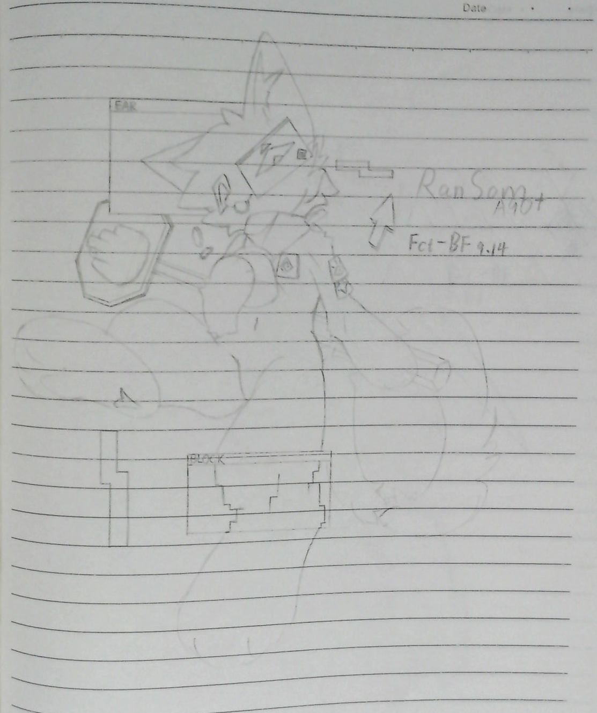
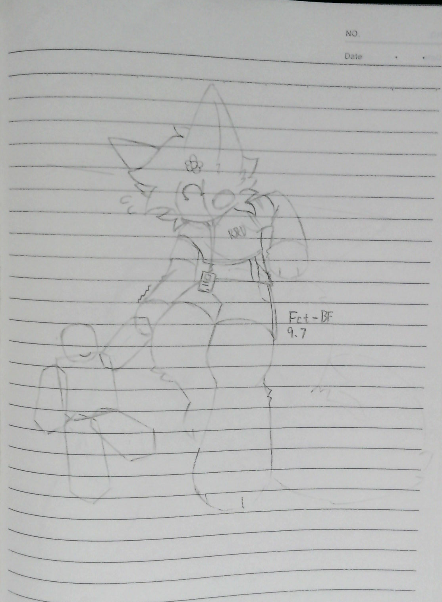
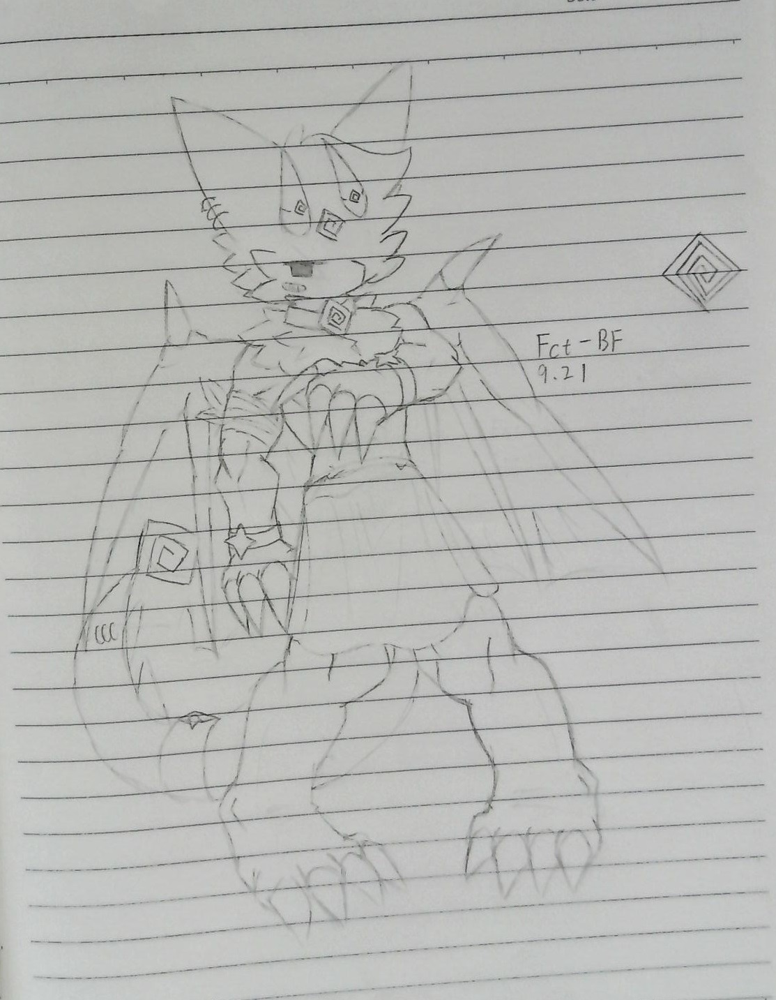

# 画廊 / Gallery

围绕 Ransom（A-90）的同人画作。全部为作者本人作品。

> **怎么填：** 每个作品下面有四个空位（中文标题 / 中文描述 / English title / English description），
> 把 `待填` 那两个汉字直接替换成你要写的内容就行；英文栏不想填可以整行删掉。
> **怎么加新作品：** 把图片放进 `docs/gallery/`，然后在文件末尾照抄一份"模板"补上对应小节和目录行。

---

## 目录

| # | 预览 | 标题 | 文件 |
|---|---|---|---|
| 01 |  | A90！！ | `docs/gallery/art-01.png` |
| 02 |  | A1—F | `docs/gallery/art-02.png` |
| 03 |  | RedLight | `docs/gallery/art-03.jpg` |

---

## 01

**标题**：A90！！

**描述**：可爱的A90！！

**Title**: A-90!!

**Description**: A cute A-90!!

---

## 02

**标题**：A1—F

**描述**：我自己的A120&A200(Rooms&Doors)结合体的设子

**Title**: A1—F

**Description**: My own character design — a fusion of A-120 & A-200 (Rooms & Doors).

---

## 03

**标题**：RedLight

**描述**：A90上级(老板大概吧)，我自己的私人形象，素身(龙龙~)

**Title**: RedLight

**Description**: A-90's superior (his boss, probably) — and my own personal avatar, in his natural unclothed form (a little dragon~).

---

<!--
============================ 模板 ============================
复制下面这一节，粘到最后一个 "---" 之前，把编号和文件名换成新的：

## 04

**标题**：待填

**描述**：待填

**Title**: TBD

**Description**: TBD

---

别忘了同时在上面的"目录"表格里加一行。
==============================================================
-->
