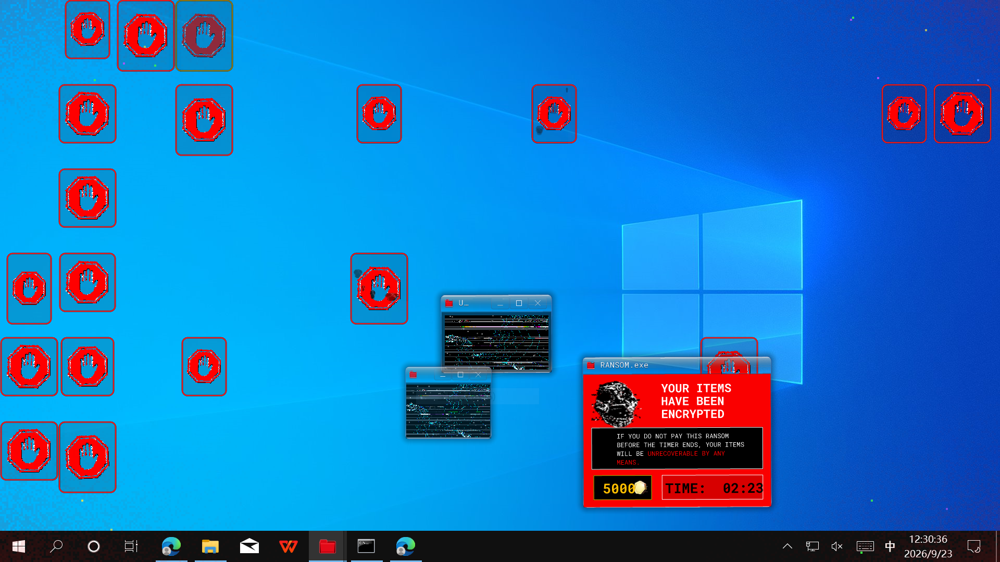
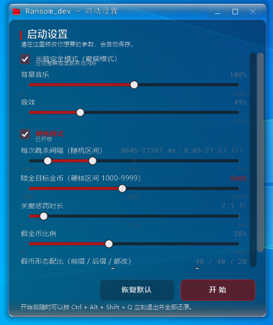
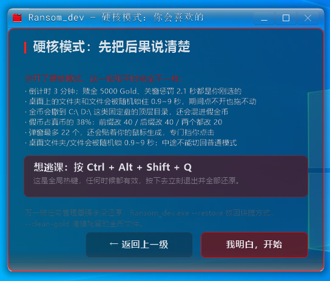

# Ransom_dev

[中文](README.md) | **English**

🎨 **[Gallery](GALLERY.md)** — fan art drawn by the author for this project.

A Windows prank program that turns the **Ransom (A-90) encounter** from *DOORS* into something that actually messes with your desktop.

A face surfaces at a random spot on your screen → you have to freeze → a red stop sign flashes for the verdict:
stay still and it withdraws; move and popups flood the screen, your desktop shortcuts get marked "encrypted",
every open program is swept into the taskbar, and you have 90 seconds to scrape together 500 Gold to buy
everything back — otherwise a jumpscare ends the show and the locked shortcuts go to the Recycle Bin.

Written in C++20 with Win32 + GDI+. **All assets are embedded in the executable**, so the artifact is a single file.



*The ransom phase, captured on a 1920 × 1080 desktop.*


> ⚠️ **Read this first**: this program really does change your desktop — it moves icons, blocks right-clicks,
> minimizes your windows, and on timeout throws shortcuts into the Recycle Bin. Every action is reversible;
> see [Safety valve and rollback](#safety-valve-and-rollback). **Read that section before running it for the
> first time.**

---

## ⚠️ About the assets in this repository (important)

The images and audio in this repository **are not my work**:

| Content | Source | Notes |
|---|---|---|
| `assets/image/`, `assets/audio/`, `assets/ransom.ico` | *DOORS* (a game on Roblox) | A-90's appearance, the stop sign, the theme song and sound effects are all the original work's copyrighted assets |
| `assets/RobotoMono-VariableFont_wght.ttf` | Google Fonts | Roboto Mono, SIL Open Font License 1.1, freely distributable |
| `Ransom_dev/src/third_party/` | stb_vorbis, minimp3 | Public domain / MIT / CC0 dual-licensed, see [NOTICE.md](NOTICE.md) |

**So: this is a personal, study-oriented fan project.** I release the *code* under MIT, but the *assets* come
with no permission of any kind. Decide for yourself whether you want to host this repository publicly. If you
do, consider one of these:

- Drop `assets/image/` and `assets/audio/` from the repository and keep only the code (the program will not be
  able to draw the face or play sound, but it still compiles);
- Or replace them with your own assets before publishing.

**If someone shared this repository with you, be aware that the asset copyright belongs to the original creators.**

---

## Requirements

| Item | Requirement |
|---|---|
| OS | Windows 10 1809 or later (uses `SetProcessDpiAwareness`, layered windows, low-level input hooks) |
| Compiler | Visual Studio 2022 (v143 toolset). The project file names the `v145` toolset; when opening with an older VS, right-click the project → "Retarget solution" |
| Components | The "Desktop development with C++" workload plus a Windows 10 SDK |
| Language standard | C++20 (the project already sets `/std:c++20`; no manual setup needed) |
| Runtime | None. The CRT is **statically linked** (`/MT`), so you can copy it anywhere and run it |
| Other | PowerShell (the build automatically runs the asset-packing script) |

The third-party decoders (ogg / mp3) are **inlined as source** and already live in
`Ransom_dev/src/third_party/` — there is nothing extra to download and no package manager involved.

## Building

### Visual Studio

Open `Ransom_dev.sln`, select `Release | x64`, and build.

### Command line

```powershell
msbuild Ransom_dev.sln /p:Configuration=Release /p:Platform=x64 /m
```

### Where the output goes

The output directories are **pinned explicitly** in the project file, so they do not follow the solution file around:

```
build\x64\Release\Ransom_dev.exe     <- this one file is all you need; every asset is inside it
build\x64\Release\Ransom_dev.pdb
build\obj\...                        <- intermediate files
```

Only `x64|Release` is a release configuration; the `Win32` and `Debug` configurations are kept around for debugging.

### How the assets get inside

At build time `tools/gen_assets.ps1` scans `assets/` and generates:

- `Ransom_dev/assets_gen.rc` — one `RCDATA` entry per asset, each with a numeric ID
- `Ransom_dev/assets_gen.txt` — the name → ID manifest

`assets.cpp` reads resource ID 1000 (that manifest) once at startup to build a table, then pulls bytes with
`FindResourceW`. So at runtime the program does **not** depend on the `assets/` directory, and changing an asset
requires a rebuild (this is deliberate: a single-file artifact is worth more).

> The script decides whether to rewrite those two files by **comparing content**, not timestamps — a new asset
> can easily arrive carrying an old timestamp (`Copy-Item` and unzip both preserve the original), and a
> timestamp-based check would silently skip the new file.

## Running it

Just double-click `Ransom_dev.exe`. It shows the [setup window](#the-setup-window) first, lurks for a few
seconds once you confirm, and then the show starts.

**For a first run, look around in this order:**

```powershell
# 1. Just look at the generated face, without touching your desktop
Ransom_dev.exe --face-demo idle

# 2. Look at the ransom window layout (renders to a PNG and exits)
Ransom_dev.exe --ui-preview preview.png --ui-grid

# 3. Now run the whole thing — but read "Safety valve" below first
Ransom_dev.exe
```

## The setup window

This is the first thing every launch shows you — **the settings window, not the show**. Every parameter for
the run is decided here:



Top to bottom: **language** → photosensitivity notice → background music → sound effects →
**game mode** (normal / hardcore / idle) → time between jumpscares (random range) → ransom goal
(normal and hardcore, one slider each) → child-window punishment duration → fake coin ratio →
fake coin mix → … → gold drive scope (hardcore only, opens the 2D drive page).

After you press "start" there is one more **pre-show notice** (titled "emergency notice" in normal mode, and
"hardcore mode warning" in hardcore): it echoes back the values you just chose and puts the escape hotkey
`Ctrl + Alt + Shift + Q` front and centre. The show only begins once you press "I understand, start";
"back one level" returns you to the settings.

> The settings window grew more controls than fit on one screen: there is a **scrollbar on the right**.
> With the wheel over a slider track you fine-tune that one row; over empty space you scroll the page.
> The two buttons at the bottom are not part of the scroll region, so they are always visible.

Parameters are stored in `%LOCALAPPDATA%\Ransom_dev\settings.ini`. To skip the setup window and start straight
away with the previous values, use `--no-setup`.

## Languages (language packs)

Every piece of text you can see lives in **`assets\lang\*.lang`** — not a single string is hard-coded
in C++. The top row of the setup window, **Language**, is a drop-down that takes effect the moment you
pick it, and is **written to `settings.ini` right then** (`[ui] language=`). Only that one key is
written, so you do not have to click START first — otherwise picking a language and closing the window
would quietly revert on the next launch.

Language packs travel the same road as images and audio: `tools\gen_assets.ps1` compiles them into
RCDATA resources inside the exe, so the build output stays a single file. Two ship in the repo:

| File | Code | Shown in the drop-down |
|---|---|---|
| `assets/lang/zh-CN.lang` | `zh-CN` | 简体中文 (the default, and the fallback for missing keys) |
| `assets/lang/en-US.lang` | `en-US` | English |

**Adding a language means adding a file — not a line of C++**:

1. Copy `assets/lang/zh-CN.lang` and rename it `<code>.lang` (say `ja-JP.lang`);
2. Change `meta.name` to the language's own name (that is what the drop-down shows) and translate
   the values. Do **not** touch the key names — the code looks strings up by name;
3. Drop it back into `assets\lang\` and rebuild. The drop-down gains an entry on its own.

The format (the same notes are at the top of every pack):

* One `key = value` per line; lines starting with `#` or `;` are comments, blank lines are ignored;
* **No C++ escaping in values**: a single backslash (`C:\ D:\`) and a single percent sign (`50%`);
* The exception is **format strings** (values containing `%d` / `%.1f` / `%s` / `%c`): the number,
  order and type of placeholders must not change — translate the words, move the placeholders across
  verbatim; a literal percent sign is still `%%`;
* A forgotten key is harmless: it falls back to the `zh-CN` pack, so nothing goes blank or crashes;
* **A whole pack going missing** (you deleted or renamed the `.lang`, or the ini holds a typo) is
  handled too: the next launch falls back to `en-US` instead of failing to open the UI or printing
  raw key names everywhere.

The Chinese text inside `elog::Write` is **not** part of the packs: that is diagnostic output written
to the log file, which players never see, and it exists in Chinese only.

## Safety valve and rollback

Every place where the program touches your desktop has a way back:

| Situation | How to get out |
|---|---|
| **Want to stop immediately, any time** | Press `Ctrl + Alt + Shift + Q` (a global hotkey, exempt from the movement check, so it never counts against you. **In hardcore mode it still stops on the first press**) |
| Gold shortcuts left behind | `Ransom_dev.exe --clean-gold` |
| Shortcuts were sent to the Recycle Bin | `Ransom_dev.exe --restore` |
| Windows we swept away did not come back | Every normal exit path **always restores them**; being force-killed from Task Manager does not — in that case just click them on the taskbar once |
| Desktop icons were moved | Right-click the desktop → "View" → toggle "Auto arrange icons" on and off again; the icons snap back |

Every normal exit path (paid, timed out, safety-valve hotkey, window closed) will: restore the windows, delete
every generated gold shortcut, and put the confiscated shortcuts back where they came from, following the manifest.

## Hardcore mode

There is a "hardcore mode" switch in the setup window (the window shakes when you turn it on).



*With hardcore mode on, the screen before the show lists the values you just picked — that screen is meant to
be **read**, not decorated.*

With it on, the run becomes:

| Item | Normal | Hardcore |
|---|---|---|
| Ransom countdown | 90 seconds | **3 minutes** |
| Ransom goal | adjustable 10 – 1000 (default 500) | adjustable **1000 – 9999** (default 5000; anything above 9999 is cut off) |
| Gold denominations | 10 – 500 | **50 / 75 / 100** (about 74 genuine coins) |
| Theme song | original (trimmed to 1:30) | **remix** (first 3:30, sped up without pitch change to 3:00) |
| Popups | up to 14 at once | up to 22, and they **spawn against your mouse cursor** to block your clicks |
| Closing a child window | adjustable 0 – 18 s (default 10 s) | adjustable 0 – 30 s (default 30 s); closing 6 kills the run |
| Desktop lockdown | shortcuts only | also **randomly locks non-shortcut items** (folders / files) for 0.9 – 9 s, fading out green when they expire |
| Where gold lands | desktop only | desktop **+ the top-level directory of every fixed drive** |
| Fake coins | none | ratio adjustable **0 – 100%** (default 35%), plus a **dual-slider** track controlling the "prefix swapped / digits swapped / both swapped" mix |

The safety valve stops on the first press **exactly as it does normally** — that is deliberate: no extra
"press it twice" threshold is left in.

Two things worth spelling out:

- **Fake coins.** A share of the generated coins are counterfeits (35% by default, adjustable from 0 to 100%
  in the settings). They are ordinary shortcuts whose *filename* has been rewritten with look-alike characters
  (`Gold_50` → `G01d_5o`). Double-clicking one pays **nothing**; instead you take a punishment based on which
  part was corrupted: with the `Gold` prefix swapped, the countdown loses "denomination × 0.1" seconds; with the
  digits swapped, the unpaid ransom goes **up** by the denomination; with both swapped, both triggers fire at
  once. The mix of those three forms is controlled by **a single dual-slider track** (the same mechanism as the
  "time between jumpscares" row): two beads cut the 0 – 100 range into three segments —
  **left red = prefix swapped, middle green = suffix swapped, right red = both swapped**. The third segment has
  no bead of its own; it swallows whatever is left after the first two, which is why the three forms can never
  all be zero at once (push both beads fully left and everything lands in "both swapped"). The ransom that gets
  pushed up is **not permanent** — genuine coins you pick up afterwards go towards that debt first, and the
  reading returns to its normal pace once it is paid off.
- **No switching mid-run.** A run goes all the way through: whatever the settings say when it starts is what
  this run uses.

The switch lives in `%LOCALAPPDATA%\Ransom_dev\settings.ini` as `[game] hardcore=`. In hardcore the gold is
scattered into the top-level folders of fixed drives such as `C:\` and `D:\`, so `--clean-gold` scans those
locations too (the criteria are still "the target points at this program and the arguments contain
`--pay`/`--token`", so it will not touch your own files).

## The show

```
IDLE ──> face surfaces at a random spot FACE ──> teleports to center CENTER (stop sign appears)
                                                        │
                                    stop sign shows for ~1s: "do not move"
                                                        │
                                        ┌───────────────┴───────────────┐
                             didn't move│                               │moved
                                        ▼                               ▼
                                  ESCAPED                           CAUGHT
                            face shows once more              jumpscare ──> loading screen
                             and then leaves                          │
                                                                      ▼
                                                            RANSOM (90 seconds)
                                              · popups everywhere + desktop icons marked "encrypted"
                                              · every open program swept into the taskbar
                                              · click the gold shortcuts that spawn on the desktop to reach 500 Gold
                                                                      │
                                              ┌───────────────────────┴───────────────────────┐
                                        paid  │                                               │timeout
                                              ▼                                               ▼
                                            PAID                                           PUNISH
                                    thank-you screen + full restore            jumpscare + shortcuts to the Recycle Bin
```

The "you moved" check is generous: mouse movement beyond the tolerance (20 px by default) or any keypress gets
you caught. `--tolerance N` loosens it.

## Command-line options

| Option | Effect |
|---|---|
| `--phase NAME\|N` | Jump straight to a phase and stop there. Names: `潜伏 / 任意位置浮现 / 瞬移到中央 / 停牌判定 / 避开 / 被抓 / 付清 / 惩罚`, or the number 0-7 |
| `--no-auto` | Do not advance phases automatically (use with `--phase` to study a single frame) |
| `--tolerance N` | Mouse tolerance in pixels, 20 by default |
| `--no-audio` | Do not start audio |
| `--no-overlay` | Do not start the desktop overlay (no boxes drawn, no clicks blocked) |
| `--overlay-topmost` | Keep the overlay on top (by default it sits at the desktop layer and normal windows cover it) |
| `--no-block-menu` | Do not block the right-click menu on encrypted icons (**for troubleshooting**) |
| `--no-lockdown` | Do not minimize other programs during the ransom (**for troubleshooting**) |
| `--no-guardian` | Do not start the two-process watchdog (for debugging; also skipped automatically when a debugger is attached) |
| `--no-setup` | Do not show the setup window or the pre-show notice; start straight from `settings.ini` |
| `--diag PATH` | Write the diagnostic log to a file. A GUI subsystem has no console, so this is how you debug |
| `--face-demo MODE` | Show one face only: `idle` / `stop` / `attack` / `loading` |
| `--face-dump DIR` | Export the procedurally generated faces to PNG and exit |
| `--audio-dump PATH` | Render every sound effect offline to a WAV and exit (for checking waveforms) |
| `--theme-dump PATH` | Export the processed theme song to a WAV and exit (for listening) |
| `--ui-preview PATH` | Render the ransom window layout to a PNG and exit (for tweaking the layout without running the show) |
| `--ui-grid` | With `--ui-preview`, overlay a coordinate grid on the preview |
| `--payup` | With `--ui-preview`, preview the payment screen layout instead |
| `--setup-ui PATH` | Render the setup window to a PNG and exit (for tweaking the layout) |
| `--notice-ui PATH` | Render the pre-show notice window to a PNG and exit |
| `--setup-grid` | With either of the two above, overlay a coordinate grid on the preview |
| `--fx-demo NAME PATH` | Export the effect layer to a PNG on its own: `glow` / `black` / `stop` |
| `--clean-gold` | Just scan for and delete leftover gold shortcuts, then exit |
| `--restore` | Restore confiscated shortcuts from the Recycle Bin using the manifest, then exit |
| `--image-dir DIR` / `--audio-dir DIR` | Override the asset directories (by default assets come from the embedded resources) |

## How it compares to similar projects

> Checked on 2026-09-27, from each repository's public information (GitHub API / file listings /
> READMEs / source keywords). **Line counts are estimated at 32 bytes per line** (this repo's is
> measured), and anything marked "not verified" simply had no evidence — nothing here is guessed.
> Skip to "What makes this one different" for the short version.

### Identity and technology

| Project | Language / stack | Build output | Repo size | Source size | Activity |
|---|---|---|---|---|---|
| **This repo** | C++20 + Win32 + GDI+ | **Single 7.7MB exe**, every asset embedded, no runtime to install | 16.2MB (6.8MB of assets) | 41 files / **16,133 lines** (measured) | In development locally; [public repo](https://github.com/Wqawa/Doors-ransom) pushed 09-26 |
| [Ixars/ransomdoors](https://github.com/Ixars/ransomdoors) | C# / WPF (.NET) | Needs the .NET runtime; build output is committed straight into the repo | **598MB** (.dll 364MB, seven .exe files 56MB, .resources 151MB — **the whole build tree is committed**) | 24 files ≈3.2k lines | Created 09-02, **last push 09-09**; 102★ / 36 forks, 51 open issues |
| [khoichon/rans0m-crossplatform](https://github.com/khoichon/rans0m-crossplatform) | JS / Electron (libuiohook for global input hooks) | Windows / macOS / Linux | 50MB (assets **reused verbatim from Ixars**) | 23 files ≈2.9k lines | 09-19 → 09-20; 3★ |
| [masashira0212-stack](https://github.com/masashira0212-stack/Doors-Ransom-A-90-Simulation) | Python + tkinter | `ransom.exe` + `ransom_setting.exe` (PyInstaller) | 6.25MB | 19 files ≈10k lines (lots of tests) | 09-04 → 09-07; 14★ / 7 forks |
| [deepcoolforce23/Ransom-Doors](https://github.com/deepcoolforce23/Ransom-Doors) | Python + Qt | Source only | 11.8MB (7MB audio) | 3 files ≈6k lines | 09-12 → **09-24 (still active)**; 0★ |
| [CagriLo3169/A-90-Ransom-GDI](https://github.com/CagriLo3169/A-90-Ransom-GDI) | Not verified (**no source in the repo**) | Only `Source-Code.tar.gz` (6MB) + `dist.zip` (20MB) | 24.9MB | — | 09-07 → 09-08; 3★ |
| [Kovax00/Ransomware-POC-Doors](https://github.com/Kovax00/Ransomware-POC-Doors) ⚠️ | Python | Source only | 18.8MB (16.8MB of wav) | 12 files ≈1.6k lines | Created and pushed 09-06; 1★ |
| [gidrobater/RansomDoorsPrank](https://github.com/gidrobater/RansomDoorsPrank) / [calamoy/ransom-doors](https://github.com/calamoy/ransom-doors) | — | — | **Empty repositories** | — | — |

### Behaviour and how much you can tune

| Project | How faithful it is | Configuration | What it does to your desktop | Exit / restore |
|---|---|---|---|---|
| **This repo** | The full chain: face appears → stop-sign check → jumpscare → loading bar → gold ransom; original assets, with procedurally generated fallbacks | Setup window (three game modes, a dozen sliders, the 2D drive page) + `settings.ini` + command-line switches + **language packs** | **Only ever writes `.lnk` files**, locks desktop icons with an overlay, sends shortcuts to the Recycle Bin; **never actually encrypts anything**; gold can be limited to chosen drives | Safety valve `Ctrl+Alt+Shift+Q` stops it on a single press; all four exit paths restore everything; `--restore` / `--clean-gold` as manual fallbacks |
| Ixars | Full chain plus a rare `.crucifix` that clears the ransom instantly; coins are `.gold1`–`.gold6` **files** dropped in your user folders; changes the cursor and **turns the wallpaper dark red** | Config window; **opt-in** "crash on death" (really runs `shutdown /s /t 0`) and "run command on death" | Writes files into user folders, changes wallpaper and cursor | Failing just resets by default; shutdown / arbitrary commands are opt-in and off out of the box |
| khoichon | A port of Ixars (self-described line-by-line); `config.json` is **interchangeable with the original** | Electron config; coins go to Desktop/Downloads, or into a temporary "drawer" directory instead | Drops coin files, changes the wallpaper | Wallpaper has explicit safety rules ("it used to leave the wallpaper stuck dark"); **`restore()` runs on every exit path** |
| masashira0212 | Warning / STOP / LOADING / success and failure shows plus a desktop overlay (Japanese project, with a Japanese PC guide) | **Separate settings app** (timer seconds, popup scale, rebindable hotkeys) + a pile of test scripts + an AV-false-positive review | **Covers desktop icon slots (including non-`.lnk` shell items)**, changes the wallpaper, registers global hotkeys | A "Restore desktop" button and hotkey; plus a `recovery_watchdog.py` watchdog |
| deepcoolforce23 | Leans horror: you open drop-down menus on randomly spawning windows hunting for a coin; corrupted entries lose instantly, glitch windows teleport around | Not verified | **Moves your files into `%APPDATA%\RansomIconData`**, leaves a stop-sign shortcut pretending they are "encrypted", changes the wallpaper, and **drops `WindowsSecurityHealth.lnk` into your startup folder** | Win and the files come back; ships `icon_backup.json` and `restore_desktop_icons()` |
| CagriLo3169 | Claims to be a harmless visual simulator; the README lists 25 Win32 GDI screen effects | Not verified | Not verified (source is inside the archives) | Not verified |
| Kovax00 ⚠️ | **Really encrypts**: ChaCha20-Poly1305 + RSA-OAEP; **shuts the machine down** if you miss the 24-hour deadline; ships `decrypt_tool.py` | Not verified | Actually rewrites your files (encryption) | Only the private key plus all five coins get you back; the author labels it "not a simulation, irreversible" |

### What makes this one different

- **The artifact**: the only one here that is **native Win32, a single exe, with no runtime to install**. Ixars needs .NET (and carries 598MB of build output in its repo), khoichon needs Electron, masashira and deepcool need Python plus a packer.
- **How far it goes on your desktop**: only this repo and masashira0212 genuinely cover desktop icons; deepcoolforce23 goes further and moves files around **and plants a startup shortcut**; **only Kovax00 really encrypts** (its own author writes a destructive-effects warning) — the exact anti-pattern this project's red line forbids (write `.lnk` only, never encrypt).
- **The way out**: this is the only project whose public documentation spells out the whole set — a one-press safety valve, four exit paths that all restore, plus `--restore` / `--clean-gold`. khoichon also does restore seriously (every exit path), and masashira0212 ships a restore button and a watchdog.
- **Tuning and languages**: only this one has a dozen tunables in a setup UI with a 2D drive page and a `settings.ini`, and **only this one has language packs**.

> Two things not verified yet: [R4NS0M SIMULATOR](https://gamejolt.com/games/r4ns0m/1098499) (NatureStudio) on itch.io / GameJolt is a **game-style fangame** ("collect gold, pay the ransom, get your files back") that leaves your system alone — no stack details found; and the Android build by robotkjgh could not be located at all.

## Project layout

```
Ransom_dev.sln
├─ Ransom_dev/                  project files
│  ├─ Ransom_dev.vcxproj        output dirs, toolset and the asset-packing target all live here
│  ├─ Ransom_dev.rc             app icon + #include of the asset manifest
│  ├─ assets_gen.rc / .txt      <- generated, do not edit by hand
│  └─ src/
│     ├─ entity_main.cpp        entry point: command line, message loop, panic hotkey
│     ├─ director.cpp           the encounter scheduler (the flowchart above is this file)
│     ├─ face.cpp               A-90's face, procedurally generated
│     ├─ fx.cpp                 full-screen effect layer: corner glow, black veil, noise
│     ├─ popup.cpp              the popup storm + the ransom window
│     ├─ aero_window.cpp        window wrapper with a custom-drawn title bar
│     ├─ ui_layout.cpp          **data-driven layout** for the ransom window
│     ├─ desktop_overlay.cpp    desktop icon overlay + input blocking (all the hooks live here)
│     ├─ lockdown.cpp           sweeps other programs into the taskbar during the ransom, and keeps them there
│     ├─ gold.cpp               gold shortcuts (double-clicking one = paying the ransom)
│     ├─ recycle.cpp            timeout punishment: shortcuts to the Recycle Bin
│     ├─ motion.cpp             the "did you move?" mouse/keyboard detection
│     ├─ audio.cpp / audio_clip.cpp   mixing and decoding (ogg/mp3)
│     ├─ assets.cpp / image_blob.cpp  reading the embedded assets
│     ├─ entity_log.cpp         diagnostic log
│     ├─ guardian.cpp           two-process watchdog: a normal exit signals Disarm, a force-kill is punished
│     ├─ settings.cpp           parameter persistence (reading and writing settings.ini)
│     ├─ setup_ui.cpp           the setup window + the pre-show notice (custom-drawn UI)
│     └─ third_party/           stb_vorbis (ogg), minimp3 (mp3), inlined as source
├─ assets/                      assets (packed into the executable)
│  ├─ main_window.ini           layout of the ransom window
│  ├─ payup.ini                 layout of the payment screen
│  ├─ image/  audio/            images and audio
│  ├─ ransom.ico                application icon
│  └─ dump/                     exported sample faces (safe to delete)
├─ tools/gen_assets.ps1         scans assets\ and generates the resource manifest
└─ docs/screenshots/            screenshots used by the READMEs (not built, never packed into the exe)
```

## A few design trade-offs (and why)

Some pitfalls were hit along the way. They are all recorded in the code comments; here are the interesting ones:

**The layout is not hard-coded.** Every position, size and colour of the ransom window lives in
`assets/main_window.ini`, so tweaking it needs no rebuild; combined with `--ui-preview` you can render the layout
straight to a PNG, grid overlay included, to read off coordinates.

**Touching the desktop has to happen at the lowest level of the OS.** "The icon cannot be dragged" and "no
right-click menu appears" are both implemented by swallowing messages in a `WH_MOUSE_LL` low-level hook. One
counter-intuitive point: **drag prevention must intercept the button *down*,** not the button *up* — the
drag-and-drop loop runs on this process's UI thread, and once it runs past the timeout the system gives a hook
(about one second) the hook is **silently removed**. Intercepting on button-up would let anyone bypass it simply
by dragging slowly. Hooks being dropped is a nasty problem in itself, so the overlay's timer re-installs the
hooks on every tick as a safety net.

**There are two sets of rectangles: one for drawing, one for hit testing.** The boxes the overlay draws carry a
per-frame random jitter (so the icons look restless), but hit testing must use the un-jittered set — otherwise
the detection region drifts along with the jitter and a click that clearly lands on an icon gets missed.

**The lockdown has to guard against whack-a-mole.** After minimizing every window during the ransom, a few UWP
windows bounce right back. If the watchdog just shoved them down again blindly, it would become a futile loop
every 150 ms (measured: 1159 rounds in a single show). So it knows when to give up: after 6 attempts on the same
window it lets that one go, and writes the name to the log.

## Known limitations

- **Architecture**: only the x64 release configuration is maintained. The Win32 configuration compiles but is untested.
- **Multiple monitors**: face positions and popup distribution are computed from the primary monitor's size; nothing happens on secondary monitors.
- **Taskbar**: clicking a taskbar button can still pull a swept-away window up for a **brief flash** — that click is an ordinary mouse message sent to explorer and outside the jurisdiction of a keyboard hook. Closing that hole completely would require a `WH_SHELL` hook.
- **UWP windows**: see the whack-a-mole note above; a few UWP apps cannot be kept down.
- **Force-kill does not restore**: if the process is force-killed from Task Manager, the swept-away windows and gold shortcuts are left behind; clean up with `--clean-gold`.
- **explorer restart**: the overlay re-finds the desktop window, but icon position information is lost for one frame.

## License

Code: MIT, see [LICENSE](LICENSE).
Third-party and assets: see [NOTICE.md](NOTICE.md) — **the game assets are not covered by the MIT license**.
