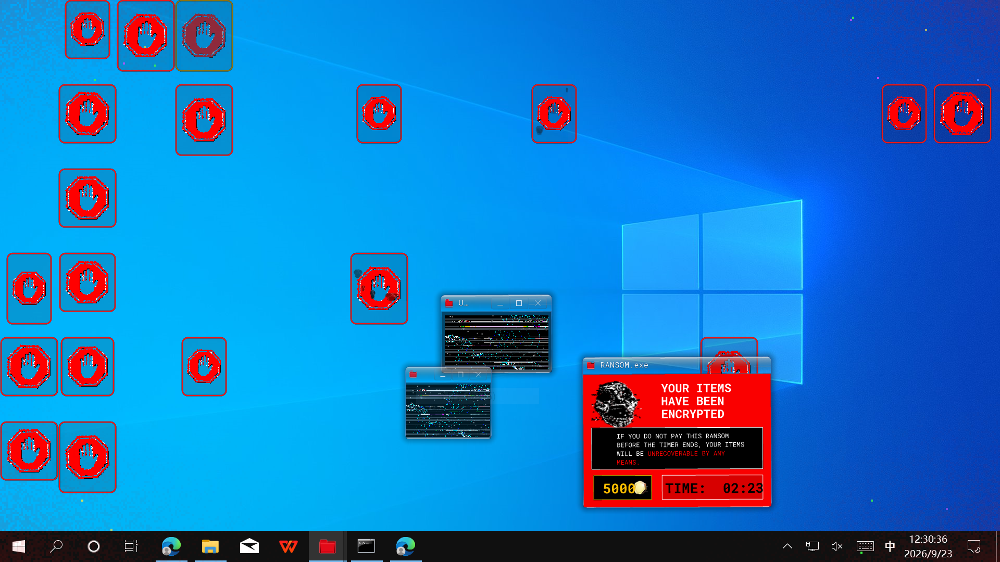
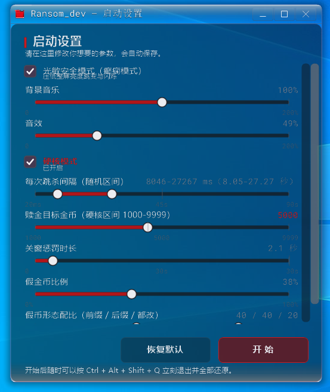
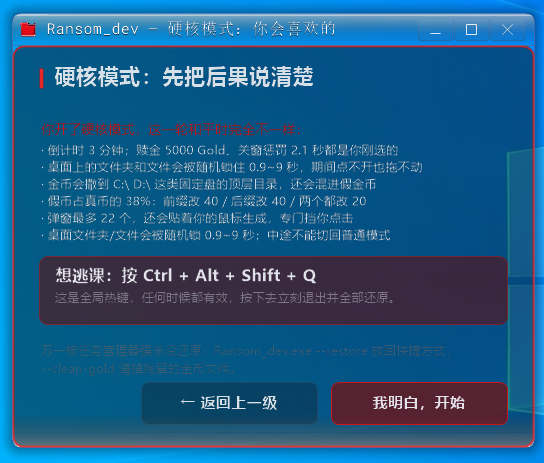

# Ransom_dev

**中文** | [English](README.en.md)


把《DOORS》里的 **Ransom（A-90）遭遇战**做成一个真的会动你桌面的 Windows 整蛊程序。

脸在你的屏幕上随机浮现 → 你必须停下不动 → 红色停牌闪现的那一瞬判定：
没动，它退走；动了，满屏弹窗糊上来，桌面快捷方式被标记成「已加密」，
所有开着的程序被收进任务栏，你必须在 90 秒内凑够 500 Gold 赎回，
否则 jumpscare 收场、被锁的快捷方式进回收站。

用 C++20 写成，Win32 + GDI+，**素材全部内嵌在 exe 里**，产物就是一个单文件。



*勒索阶段实拍（1920 × 1080 全屏）。*

> ⚠️ **先读这个**：这个程序会真的改你的桌面 —— 移动图标、拦住右键、把窗口最小化、
> 超时还会把快捷方式丢进回收站。所有动作都是可逆的，回滚办法见
> [安全阀与回滚](#安全阀与回滚)。**第一次跑之前请先看那一节。**

---

## ⚠️ 关于仓库里的素材（重要）

这个仓库里的图片和音频**不是我的作品**：

| 内容 | 来源 | 说明 |
|---|---|---|
| `assets/image/`、`assets/audio/`、`assets/ransom.ico` | 《DOORS》（Roblox 上的游戏） | A-90 的形象、停牌、主题曲、音效都是原作的版权素材 |
| `assets/RobotoMono-VariableFont_wght.ttf` | Google Fonts | Roboto Mono，SIL Open Font License 1.1，可自由分发 |
| `Ransom_dev/src/third_party/` | stb_vorbis、minimp3 | 公有领域 / MIT / CC0 双许可，见 [NOTICE.md](NOTICE.md) |

**所以：这是一个个人学习性质的同人项目。** 代码部分我按 MIT 放出来，但**素材部分没有任何授权**，
请自行判断你要不要公开托管这个仓库。如果你打算公开，建议：

- 要么把 `assets/image/` 和 `assets/audio/` 从仓库里拿掉，只留代码（程序会因为没有素材而
  画不出脸 / 没声音，但能编译）；
- 要么自己替换成自制素材，再公开。

**如果你是被别人分享到这个仓库的，请知悉素材版权在原作方。**

---

## 环境要求

| 项目 | 要求 |
|---|---|
| 系统 | Windows 10 1809 及以上（用到了 `SetProcessDpiAwareness`、分层窗口、低层输入钩子） |
| 编译器 | Visual Studio 2022（v143 工具集）。工程文件里的工具集是 `v145`，用旧版 VS 打开时右键工程 →「重定解决方案目标」即可 |
| 组件 | 「使用 C++ 的桌面开发」工作负载 + Windows 10 SDK |
| 语言标准 | C++20（工程里已设 `/std:c++20`，不用自己配） |
| 运行时 | 不需要。CRT 是**静态链接**（`/MT`），拷走就能跑 |
| 其它 | PowerShell（构建时自动跑素材打包脚本） |

第三方解码器（ogg / mp3）是**源码内联**的，已经放在 `Ransom_dev/src/third_party/`，
不需要额外下载或包管理器。

## 构建

### Visual Studio

打开 `Ransom_dev.sln`，选 `Release | x64`，生成即可。

### 命令行

```powershell
msbuild Ransom_dev.sln /p:Configuration=Release /p:Platform=x64 /m
```

### 产物在哪

输出目录在工程文件里**显式钉死**了，不跟解决方案文件跑：

```
build\x64\Release\Ransom_dev.exe     ← 就这一个文件，素材全在里面
build\x64\Release\Ransom_dev.pdb
build\obj\...                        ← 中间文件
```

只有 `x64|Release` 是发布配置；`Win32` 和 `Debug` 配置也保留着，方便调试。

### 素材是怎么进去的

构建时 `tools/gen_assets.ps1` 会扫描 `assets/`，生成：

- `Ransom_dev/assets_gen.rc` —— 每个素材一条 `RCDATA`，配一个数字 ID
- `Ransom_dev/assets_gen.txt` —— 名字 → ID 的清单

`assets.cpp` 启动时读 ID 1000 那份清单建表，之后用 `FindResourceW` 取字节。
所以运行时**不依赖 `assets/` 目录**，改素材要重新编译（这是有意的：单文件产物好处更大）。

> 脚本靠**比内容**而不是比时间戳来决定要不要重写这两个文件 —— 新素材完全可能带着
> 旧时间戳进来（`Copy-Item` 和 unzip 都会保留原时间），按时间戳判断会安静地漏掉。

## 跑起来

直接双击 `Ransom_dev.exe`。它会先弹出[启动设置](#启动设置界面)，确认过参数之后潜伏几秒，再开始演出。

**第一次跑建议先看看会发生什么，用这个顺序**：

```powershell
# 1. 先只看画出来的脸长什么样，不碰桌面
Ransom_dev.exe --face-demo idle

# 2. 看勒索主窗口的排版（渲染成 PNG 就退出）
Ransom_dev.exe --ui-preview preview.png --ui-grid

# 3. 真要跑整场了 —— 记得先读下面的「安全阀」
Ransom_dev.exe
```

## 启动设置界面

这一屏是每次启动的第一站 —— 全场的参数都在这里定：



从上到下：光敏安全提示 → 背景音乐 → 音效 → **硬核模式** → 每次跳杀间隔（随机区间）→ 赎金目标 →
关窗惩罚时长 → 假金币比例 → 假币形态配比。

点「开始」之后还有一屏**开演前提示**（普通模式叫「应急提示」，硬核模式换成「硬核模式警告」）：
它把你刚选的数值回声一遍，并把退出口诀 `Ctrl + Alt + Shift + Q` 摆在最显眼的位置。
点「我明白，开始」才真正开演，点「返回上一级」可以退回设置重挑。

> 设置窗口里的控制项变多了，一屏放不下：**右侧有滚动条**，
> 滚轮压在滑条上就是微调那一条、压在空白处才是滚动整屏。
> 窗口底部那两个按钮不参与滚动，永远看得见。

参数存在 `%LOCALAPPDATA%\Ransom_dev\settings.ini`。想跳过设置直接用上次的值开演，用 `--no-setup`。

## 安全阀与回滚

程序动你桌面的每一处都留了退路：

| 情况 | 怎么退 |
|---|---|
| **任何时候想立刻停** | 按 `Ctrl + Alt + Shift + Q`（全局热键，被判定逻辑豁免，不会误伤。**硬核模式下也一样，按一次就退**） |
| 金币快捷方式没清干净 | `Ransom_dev.exe --clean-gold` |
| 快捷方式被丢进回收站了 | `Ransom_dev.exe --restore` |
| 被收走的窗口没还回来 | 程序正常退出的路径**一定会还原**；被任务管理器强杀不会 —— 那种情况去任务栏点一下即可 |
| 桌面图标被挪了 | 桌面右键 →「查看」→ 勾「自动排列图标」再取消，图标会归位 |

正常退出的路径（付清 / 超时受罚 / 按安全阀 / 关闭窗口）都会：还原窗口、
删掉全部生成的金币快捷方式、把被没收的快捷方式按清单放回原位。

## 硬核模式

启动设置里有一个「硬核模式」开关（打开时窗口会抖一下）。



*开了硬核模式，开演前那一屏会把你刚选的数值逐条列出来 —— 这一屏是要人**读**的，不是装饰。*

开着它，这一轮演出会变成：

| 项目 | 普通 | 硬核 |
|---|---|---|
| 勒索倒计时 | 90 秒 | **3 分钟** |
| 赎金目标 | 可调 10 ~ 1000（默认 500） | 可调 **1000 ~ 9999**（默认 5000，超过 9999 的部分砍掉） |
| 金币面额 | 10 ~ 500 | **50 / 75 / 100**（约 74 枚真币） |
| 主题曲 | 原版（裁到 1:30） | **remix**（取前 3:30，快进不变调压到 3:00） |
| 弹窗 | 同时最多 14 个 | 最多 22 个，还会**贴着鼠标生成**挡你点击 |
| 关一个子窗口 | 可调 0 ~ 18 秒（默认 10 秒） | 可调 0 ~ 30 秒（默认 30 秒）；关 6 个就必死 |
| 桌面锁定 | 只锁快捷方式 | 另外**随机锁 0.9~9 秒的非快捷方式项**（文件夹 / 文件），到点变绿淡出 |
| 金币落点 | 只在桌面 | 桌面 **+ 各固定磁盘的顶层目录** |
| 假金币 | 无 | 比例可调 **0 ~ 100%**（默认 35%），另有一条**双滑块**控制"前缀改 / 数字改 / 两个都改"的配比 |

安全阀在硬核下**和平常一样，按一次就停** —— 这一条是刻意的，
不留任何"要按两次"的额外门槛。

两件要额外说清楚的事：

- **假金币。** 生成的金币里会混进一批"假币"（比例默认 35%，可在设置里从 0 拉到 100%），
  它们只是文件名被同形字替换过（`Gold_50` → `G01d_5o`），双击**一分钱都不进账**，
  而是按被污染的位置吃惩罚：前缀 `Gold` 被换掉 → 倒计时扣「面额 × 0.1」秒；
  数字被换掉 → 未付的赎金 +面额；两段都换掉 → 两种同时触发。
  "前缀改 / 数字改 / 两个都改"这三种形态的配比由**一条双滑块的轨道**控制
  （和"每次跳杀间隔"那条一个路子）：两颗珠子把 0~100 划成三段 ——
  **左段红＝前缀改，中段绿＝后缀改，右段红＝两个都改**。
  第三段没有自己的珠子，它把 100 减去前两段之后的部分**全吃掉**，
  所以三种形态不可能同时为 0（两颗珠子都推到最左边时，全部落进"两个都改"）。
  被顶上去的赎金**不是永久的** —— 之后捡到的真金币会先拿去还这笔债，还完读数就回到正常节奏。
- **中途不能切换。** 一轮跑到底：设置里开着什么，这一轮就是什么。

开关存在 `%LOCALAPPDATA%\Ransom_dev\settings.ini` 的 `[game] hardcore=`。
硬核下金币会散到 `C:\`、`D:\` 这类固定盘的顶层文件夹里，
所以 `--clean-gold` 也会扫那些位置（判据仍是"目标指向本程序 + 参数含 `--pay`/`--token`"，
不会碰你的东西）。

## 演出流程

```
潜伏 IDLE ──> 脸在随机位置浮现 FACE ──> 瞬移到中央 CENTER（同时闪出停牌）
                                              │
                              停牌显示约 1 秒，这期间「不许动」
                                              │
                              ┌───────────────┴───────────────┐
                         没动 │                               │ 动了
                              ▼                               ▼
                        避开 ESCAPED                     被抓 CAUGHT
                    头再露一下就走人                   jumpscare ──> 加载画面
                                                              │
                                                              ▼
                                                     勒索 RANSOM（90 秒）
                                              · 满屏弹窗 + 桌面图标标「已加密」
                                              · 所有开着的程序被收进任务栏
                                              · 去点桌面上生成的金币快捷方式攒 500 Gold
                                                              │
                                              ┌───────────────┴───────────────┐
                                         付清 │                               │ 超时
                                              ▼                               ▼
                                        付清 PAID                       惩罚 PUNISH
                                      致谢画面 + 全部还原            jumpscare + 快捷方式进回收站
```

「动了」的判定很宽：鼠标位移超过容差（默认 20px）、按了键、都会被抓。
`--tolerance N` 可以放宽。

## 命令行开关

| 开关 | 作用 |
|---|---|
| `--phase NAME\|N` | 直接跳到某个阶段并停住。名字：`潜伏 / 任意位置浮现 / 瞬移到中央 / 停牌判定 / 避开 / 被抓 / 付清 / 惩罚`，或者用序号 0-7 |
| `--no-auto` | 不自动推进阶段（必须配 `--phase` 用，方便慢慢看某一帧） |
| `--tolerance N` | 鼠标容差像素，默认 20 |
| `--no-audio` | 不启动声音 |
| `--no-overlay` | 不启动桌面覆盖层（不会画方框、不会拦点击） |
| `--overlay-topmost` | 覆盖层置顶（默认贴桌面层，会被普通窗口盖住） |
| `--no-block-menu` | 不拦被加密图标上的右键菜单（**排查问题时用**） |
| `--no-lockdown` | 勒索时不最小化别的程序（**排查问题时用**） |
| `--no-guardian` | 不启动双进程看守（调试时用；挂着调试器时也会自动跳过） |
| `--no-setup` | 不弹启动设置和开演前提示，直接用 `settings.ini` 里的值开演 |
| `--diag PATH` | 把诊断日志写到文件。GUI 子系统没有控制台，排查全靠这个 |
| `--face-demo MODE` | 只显示某一张脸：`idle` / `stop` / `attack` / `thanks` / `loading` |
| `--face-dump DIR` | 把程序生成的脸导出成 PNG 后退出 |
| `--audio-dump PATH` | 把全部音效离线渲染成 WAV 后退出（验波形用） |
| `--theme-dump PATH` | 把处理后的主题曲导成 WAV 后退出（试听用） |
| `--ui-preview PATH` | 把勒索主窗口的排版渲染成 PNG 后退出（调排版用，不用跑整场） |
| `--ui-grid` | 配合 `--ui-preview`，预览图叠坐标网格 |
| `--setup-ui PATH` | 把启动设置窗口渲染成 PNG 后退出（调排版用） |
| `--notice-ui PATH` | 把开演前提示窗口渲染成 PNG 后退出 |
| `--setup-grid` | 配合上面两个，预览图叠坐标网格 |
| `--payup` | 配合 `--ui-preview`，预览付钱那一屏的排版 |
| `--fx-demo NAME PATH` | 把特效层单独导成 PNG：`glow` / `black` / `stop` |
| `--clean-gold` | 只扫描并删除遗留的金币快捷方式，然后退出 |
| `--restore` | 按清单把被没收的快捷方式从回收站还原，然后退出 |
| `--image-dir DIR` / `--audio-dir DIR` | 覆盖素材目录（默认从 exe 内嵌资源里取） |

## 项目结构

```
Ransom_dev.sln
├─ Ransom_dev/                  工程文件
│  ├─ Ransom_dev.vcxproj        输出目录、工具集、素材打包目标都在这
│  ├─ Ransom_dev.rc             应用图标 + #include 素材清单
│  ├─ assets_gen.rc / .txt      ← 自动生成，别手改
│  └─ src/
│     ├─ entity_main.cpp        入口：命令行、消息循环、安全阀热键
│     ├─ director.cpp           遭遇战调度器（上面那张流程图就是它）
│     ├─ face.cpp               A-90 的脸，程序化生成
│     ├─ fx.cpp                 全屏特效层：四角红光、黑幕、雪花噪点
│     ├─ popup.cpp              满屏弹窗 + 勒索主窗口
│     ├─ aero_window.cpp        自绘标题栏的窗口封装
│     ├─ ui_layout.cpp          勒索窗口的**数据驱动排版**
│     ├─ desktop_overlay.cpp    桌面图标覆盖层 + 输入拦截（钩子都在这）
│     ├─ lockdown.cpp           勒索时把别的程序收进任务栏，且不让它们回来
│     ├─ gold.cpp               金币快捷方式（双击它 = 赎回）
│     ├─ recycle.cpp            超时惩罚：把快捷方式丢进回收站
│     ├─ motion.cpp             鼠标/键盘「动了没」的检测
│     ├─ audio.cpp / audio_clip.cpp   混音、解码（ogg/mp3）
│     ├─ assets.cpp / image_blob.cpp  内嵌素材的读取
│     ├─ entity_log.cpp         诊断日志
│     ├─ guardian.cpp           双进程看守：主进程正常收场会发 Disarm 事件，被强杀则由守望进程判罚
│     ├─ settings.cpp           参数持久化（settings.ini 的读写与取值）
│     ├─ setup_ui.cpp           启动设置界面 + 开演前提示（自绘 UI）
│     └─ third_party/           stb_vorbis（ogg）、minimp3（mp3），源码内联
├─ assets/                      素材（会被打包进 exe）
│  ├─ main_window.ini           勒索主窗口的排版
│  ├─ payup.ini                 付钱那一屏的排版
│  ├─ image/  audio/            图片、音频
│  ├─ ransom.ico                应用图标
│  └─ dump/                     程序自己生成的脸（导出样本，可删）
├─ tools/gen_assets.ps1         扫描 assets\ 生成资源清单
└─ docs/screenshots/            README 里用的截图（不参与构建，也不会被打进 exe）
```

## 几个实现上的取舍（为什么这么写）

写的时候踩过一些坑，都记在代码注释里了，这里挑几个值得一看的：

**排版不写死在代码里。** 勒索主窗口的位置、尺寸、颜色全在 `assets/main_window.ini` 里，
改排版不用重新编译；配 `--ui-preview` 能直接把排版渲染成 PNG，还能叠坐标网格读坐标。

**改桌面这件事必须在系统最底层做。** 「图标拖不走」「右键弹不出菜单」都是拿
`WH_MOUSE_LL` 低层钩子吞消息实现的。有个反直觉的点：**拖动的拦截必须拦在「按下」**，
不能拦在「抬起」—— 拖放循环是本进程的 UI 线程在跑，跑超过系统给钩子的超时（约 1 秒）
钩子就会被**静默摘掉**，拦在抬起的话「拖慢一点」就能绕过去。低层钩子被摘掉这件事
本身就很难缠，所以覆盖层的定时器每跳一次都会重挂一遍钩子兜底。

**判定用的矩形和绘制的矩形是两套。** 覆盖层画出来的方框带逐帧随机抖动
（看起来像图标在躁动），但命中判定必须用不带抖动的那套 —— 否则图标一抖，
判定区就跟着漂走，明明点在图标上却漏判。

**清场要防「打地鼠」。** 勒索时最小化所有窗口之后，有几个 UWP 窗口会自己弹回来。
如果守望无脑压回去，就会变成每 150ms 一次的徒劳死循环（实测一场戏累计 1159 次）。
所以加了「认输」逻辑：同一个窗口试 6 次还收不住就放弃它，并把名字写进日志。

## 已知限制

- **平台**：只做了 x64 发布配置。Win32 配置能编译，但没测过。
- **多显示器**：按主屏尺寸算的脸部位置和弹窗分布，副屏上没有演出。
- **任务栏**：点任务栏按钮仍可能把被清场的窗口拉起来**闪一下** —— 那一下是发给
  explorer 的普通鼠标消息，不在键盘钩子的管辖范围。要彻底堵死得装 `WH_SHELL` 钩子。
- **UWP 窗口**：见上面「打地鼠」那条，少数 UWP 应用收不住。
- **强杀不还原**：任务管理器强杀进程的话，被收走的窗口和金币快捷方式会留下，
  用 `--clean-gold` 清理。
- **explorer 重启**：覆盖层会重新找桌面窗口，但桌面图标的位置信息会丢一帧。

## 许可

代码：MIT，见 [LICENSE](LICENSE)。
第三方与素材：见 [NOTICE.md](NOTICE.md) —— **游戏素材不在 MIT 覆盖范围内**。
